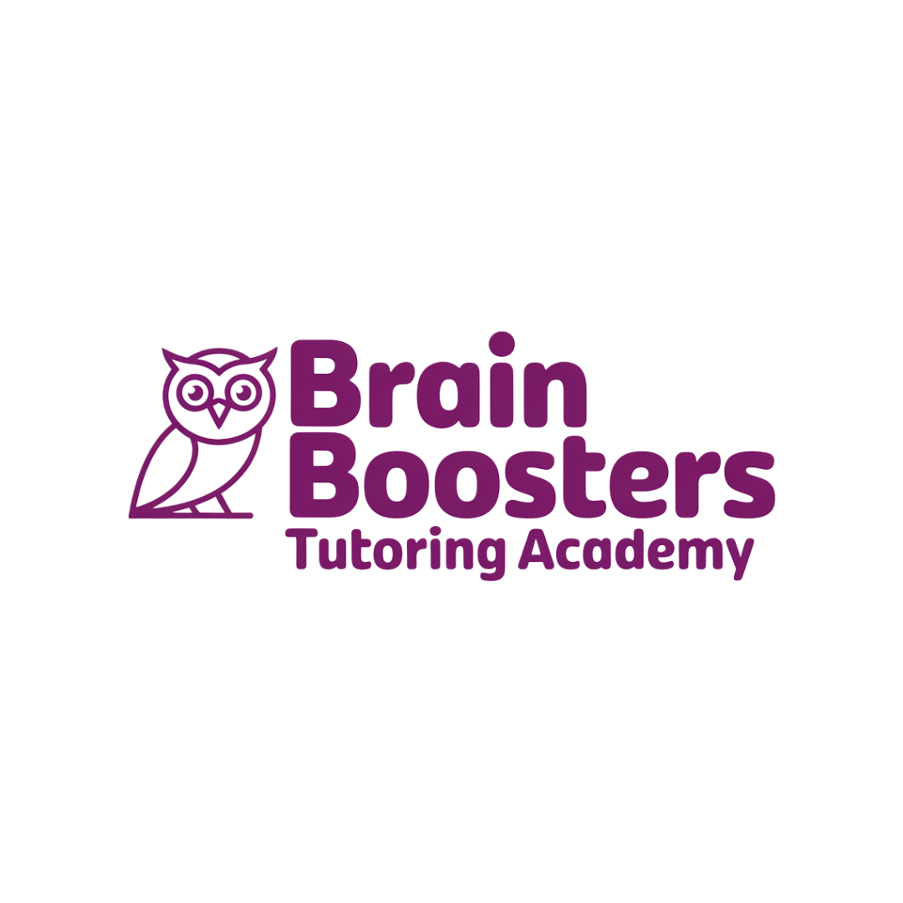

# Brain Boosters Tutoring Platform Proposal

## Team
A team of 5 developers is working together to bring the Brain Boosters online platform to life. Here's what everyone is contributing:

- **Evgenia**: Taking charge of the UX/UI design to make sure the platform is user-friendly and visually appealing.
- **Carlo**: Handling the front-end development, focusing on HTML and CSS to bring the designs to life.
- **Linlin and Kemin**: Building the back-end structure of the website to ensure it is functional and runs smoothly.
- **Helena**: Jumping in wherever needed, assisting all developers, and completing tasks as required. She’s also managing the GitHub repository to keep tasks and project documents organized.

## Users
Brain Boosters tutoring services are mainly designed for school-aged kids between 5 and 18 years old. That said, adults like tutors and parents will also be key users of the platform. Most of the activity is expected to come from users aged 20 to 60. Tutors will use the platform to set up their profiles and connect with parents nearby to schedule sessions. Parents, on the other hand, can easily browse and book tutors without needing to create a profile themselves.

## Technologies

### Django
We will be using Django for the development of the back-end structure for this project. Django’s built-in tools will make it easy to quickly build this platform. It integrates well with third-party services like Google Maps and PayPal which we will need for this project. It also has excellent documentation meaning developers have access to plenty of resources to handle any development challenges.

### HTML, CSS, JAVASCRIPT
We will use HTML, CSS, JAVASCRIPT for the development of the front-end of this project. 

## Milestones

### Week 1 - Proposal Submission & Initial Planning
- Submit the project proposal.
- Finalize tech choices (Django for back-end, React for front-end).
- Assign roles and responsibilities to each team member.
- Conduct an initial meeting to align on requirements and expectations.
- Start setting up the project repository on GitHub and outline the structure.

#### Design Inspirations
During Week 1, Carlo and Evgenia collaborated to gather design inspirations for Brain Boosters. They researched websites like Alloprof, KidKinder, and Varsity Tutors to explore how playful designs, vibrant color palettes, and user friendly layouts can engage users across a wide age range. The aim is to create a website that is fun and enjoyable for all users, from young kids to high schoolers preparing to graduate.

After gathering the research, they discussed findings with the team to refine the approach and agree on the direction for the platform’s UI. This research will inform the development of the color palette, wireframes, and mockups for the homepage, planned for the rest of Week 1.

### Week 2 - Back-End Setup & Initial Front-End Design
- Set up the Django project and database schema (User models, Tutor models, Session models).
- Implement user authentication and profile management (registration, login, password reset).
- Begin integrating third-party services (e.g., Google Maps, PayPal).
- Set up the React project and integrate with the back-end API.
- Create basic UI components.
- Work on designing the main screens (login, registration, tutor search).

### Week 3 - Core Features Development & Testing
- Implement tutor registration and profile creation.
- Build the tutor search and filtering system.
- Develop tutor listing pages with detailed profiles and availability.
- Implement the search and filter functionalities on the front-end.
- Start working on the booking system (sessions, calendar). 
- Conduct unit testing for both front-end and back-end features.

### Week 4 - User Interface Refinements & Integration
- Finalize the session booking system and ensure seamless communication between parents and tutors.
- Refine the user interface and improve the UX/UI (focus on responsiveness, style consistency).
- Integrate Google Maps API for location-based searches.

### Week 5 - Completed Project
- Final bug fixes, performance improvements.
- Complete the user interface.
- Present the completed platform.

## links 
[Entity Relationship Diagram](https://www.figma.com/design/29snC3ClqBS8nwgOWtyUag/Untitled?node-id=0-1&p=f&t=yCuSRwUnHvXf6vuv-0)
[Figma Wireframes](https://www.figma.com/design/ADalxYnFrnM7eHUqBCE8It/Brain-Boosters-Tutoring-Academy?node-id=0-1&p=f&t=xCUkPIWIOHhenD4a-0)

## Installation Steps

### 1. Clone the Repository

Run the following command in the terminal:
```
git clone https://github.com/582-41W-VA/Web-Project-2.git
````
Navigate to the project directory:
```
cd brainboosters
```

### 2. Install uv command to run script and manage python packages

- **Windows**
```
scoop install uv
```

- **Mac**
```
brew install uv
```

###  3. Set Up Python and Django

Make sure you have Python 3.8+ installed. Verify using:
```
python3 --version
```

### 4. Set up database

Apply database migrations:
```
uv run manage.py migrate
```

### 5. Run the Django Server

Start the development server:
```
uv run manage.py runserver
```
Press command + http://127.0.0.1:8000/ to see the application in browser.

## Admin Access

1. Create super user:
```
uv run manage.py createsuperuser
```

2. Access the admin dashboard at:
http://127.0.0.1:8000/admin

3. Login to admin panel:
Use the Username & Password you created for super user

## Github commits

**Clone the repository:**
```
git clone <repository-url>
```
```
cd <repository-name>
```

**Create a branch:**
```
git checkout -b branch-name
```

**Add changes to the staging area:**
*Stage all files*
```
git add .
```
*Stage specific file*
```
git add <filename>
```

**Commit changes:**
```
git commit -m "short description"
```

**Push to the branch:**
```
git push origin branch-name
```
**Review and approval:**
Create a pull request and assign to at least one team member to review your pull request, provide feedback if necessary. Your branch can be merged into the main after your request get approved.